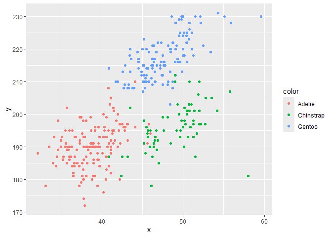

p8105_hw1_xg2489
================

``` r
library(tidyverse)
```

    ## ── Attaching core tidyverse packages ──────────────────────── tidyverse 2.0.0 ──
    ## ✔ dplyr     1.2.1     ✔ readr     2.2.0
    ## ✔ forcats   1.0.1     ✔ stringr   1.6.0
    ## ✔ ggplot2   4.0.3     ✔ tibble    3.3.1
    ## ✔ lubridate 1.9.5     ✔ tidyr     1.3.2
    ## ✔ purrr     1.2.2     
    ## ── Conflicts ────────────────────────────────────────── tidyverse_conflicts() ──
    ## ✖ dplyr::filter() masks stats::filter()
    ## ✖ dplyr::lag()    masks stats::lag()
    ## ℹ Use the conflicted package (<http://conflicted.r-lib.org/>) to force all conflicts to become errors

``` r
#load library for future use
```

``` r
data("penguins", package = "palmerpenguins")
```

This dataset contains 8 variables including species, island, bill
length(mm), bill depth(mm), flipper length(mm), body mass(g), sex and
year. The size of the dataset is 344 rows and 8 columns. The mean
flipper length is 200.92 mm.

``` r
plot_df = 
  tibble(
    x = pull(penguins, bill_length_mm),
    y = pull(penguins, flipper_length_mm),
    color = pull(penguins, species)
  )
#use "pull" to choose specific variable
ggplot(plot_df, aes(x = x, y = y, color = color)) + geom_point()
```

<!-- -->

``` r
#"geom_point()" is used to make scatter plot
ggsave("flipper_bill_scatterplot.png")
```

    ## Saving 7 x 5 in image

``` r
df = 
  tibble(
    sample  = rnorm(10),                      
    logic = sample > 0,                        
    chara   = rep(c("aa", "bb", "cc"), length.out = 10),                   
    factor   = factor(rep(c("low", "medium", "high"), length.out = 10))  
    )

sample_mean = mean(pull(df, sample))
logic_mean = mean(pull(df, logic))
chara_mean = mean(pull(df, chara))
```

    ## Warning in mean.default(pull(df, chara)): 参数不是数值也不是逻辑值：返回NA

``` r
factor_mean = mean(pull(df, factor))
```

    ## Warning in mean.default(pull(df, factor)): 参数不是数值也不是逻辑值：返回NA

``` r
sample_mean
```

    ## [1] -0.2672464

``` r
logic_mean
```

    ## [1] 0.6

``` r
chara_mean
```

    ## [1] NA

``` r
factor_mean
```

    ## [1] NA

When taking the mean of each variable, it works for numeric vectors and
logical vectors but returns “NA” in character vector and factor vector.
For logical vectors, R treats “TRUE” and “FALSE” as “1” and “0” so their
mean can be calculated.

``` r
as.numeric(pull(df, logic))
as.numeric(pull(df, chara))
as.numeric(pull(df, factor))
```

When logic vector transforms to numeric vector, it converts “TRUE” to 1
and “FALSE” to 0 so it shows no “NA”.

When character vector transforms to numeric vector, it converts
everything to “NA” as strings do not have a numerical meaning.

When factor vector transforms to numeric vector, it converts
“low”,“medium”,“high” to integers to show different factor levels so it
also shows no “NA”.

“as.numeric” explains “mean()” behaviors. Logical vector coerces to 1
and 0, making “mean()” works successfully. Character vector turns “NA”
causing “mean()” to fail. Factor vector returns internal integer levels
while “mean()” still fails because the gap between different categories
is unspecified so the mean of categories is statistically meaningless.
